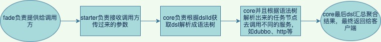
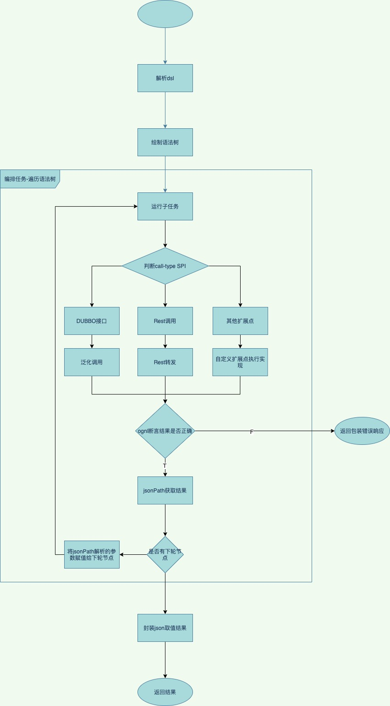

# qx-data-choreography

内部服务数据编排

### 作用在于组合多api/rpc为一个，通过数据编排的形式快速开发业务。

将支持如下服务编排：

#### 1.dubbo rpc

#### 2.rest

#### 3.sql

#### 4.feign

### 架构如下：

| data-choreography-parent |                                    | 根pom依赖管理                                                |      |
| ------------------------ | ---------------------------------- | ------------------------------------------------------------ | ---- |
|                          | data-choreography-core             | 核心逻辑实现  解析汇总各节点数据结果                                              |      |
|                          | data-choreography-starter          | SpringBoot启动类(默认对接duubo-通过引入data-choreography-dubbo-springboot) |      |
|                          | data-choreography-dubbo            | dubbo实现节点调用计算                                        |      |
|                          | data-choreography-rest             | Rest/http实现节点调用计算                                    |      |
|                          | test/data-choreography-dubbo-test  | dubbo测试模块                                                |      |
|                          | test/data-choreography-test        | 普通测试模块(ognl/json-path等)                               |      |
|                          | data-choreography-dubbo-springboot | dubbo作为对接门面实现启动                                    |      |
|                          | data-choreography-dubbo-fade       | dubbo作为门面，其他三方模块只需引入该依赖并且设置dubbo配置即可使用 |      |
|                          |                                    |                                                              |      |

#### 项目流程如下

### 业务流程如下

